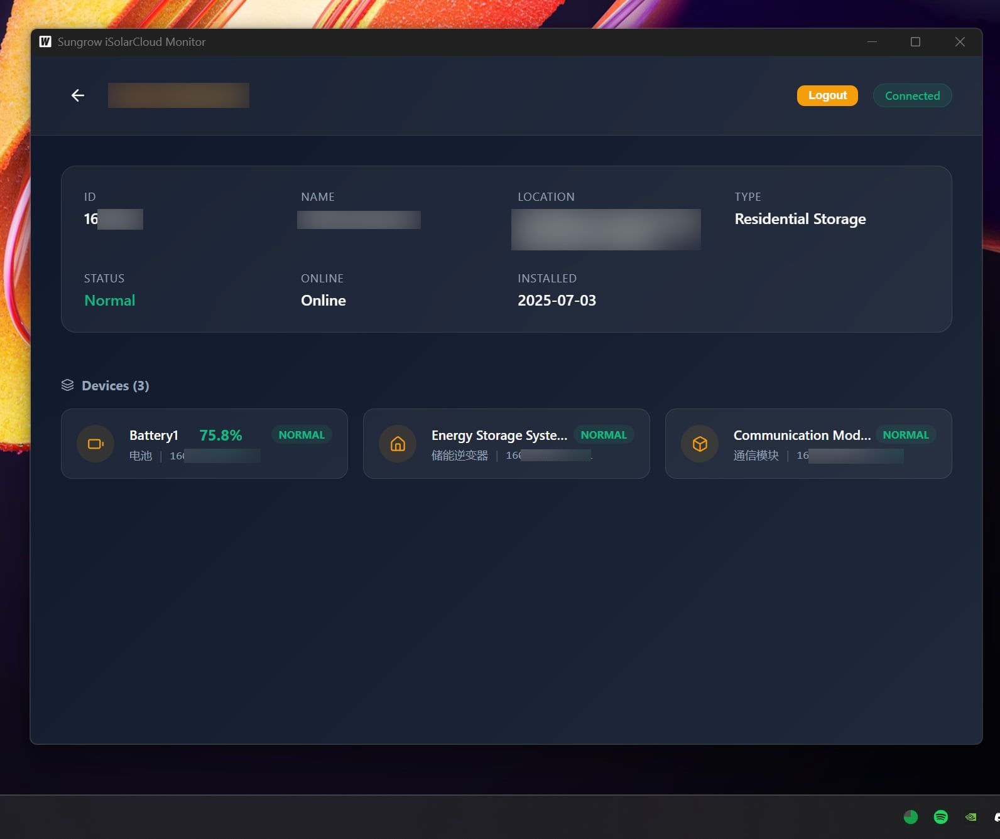

# Sungrow iSolarCloud Monitor

A lightweight cross-platform desktop application for monitoring Sungrow iSolarCloud solar systems.



Built with **Wails v2** (Go + React) for native performance and small binary size (~15MB vs 150MB with Electron).

## Features

- 🔐 OAuth2 authentication with Sungrow API
- 🏭 View all your solar plants
- 🔋 Real-time battery monitoring with auto-refresh (5 mins)
- 📊 Device-level monitoring
- 🥧 System Tray integration with dynamic battery pie chart
- 🏃 Background operation (minimizes to tray)
- 🎨 Premium glassmorphism UI
- ⚡ Native performance with WebView2 (Windows) / WebKit (macOS/Linux)

## Development

### Prerequisites

- [Go](https://go.dev/dl/) 1.21+
- [Node.js](https://nodejs.org/) or [Bun](https://bun.sh/)
- [Wails CLI](https://wails.io/docs/gettingstarted/installation)

### Setup

```bash
# Install dependencies
cd frontend && bun i && cd ..

# Generate Wails bindings
wails generate module

# Run in development mode
wails dev
```

### Building

```bash
# Build for Windows
wails build -platform windows/amd64

# Build for macOS
wails build -platform darwin/amd64  # Intel
wails build -platform darwin/arm64  # Apple Silicon

# Output will be in: build/bin/
```

The executable will be ~15MB and require no installation!

## Configuration

### OAuth Setup

1. Register at [Sungrow Developer Portal](https://developer-api.isolarcloud.com)
2. Set redirect URL to: `http://localhost:8080/callback` (the app will try ports 8080-8090 if 8080 is busy)
3. Note your App Key and Secret Key

### First Run

1. Launch the application
2. Enter credentials
3. Select your country/gateway
4. Click "Authenticate" and complete login in browser

## Architecture

- **Backend (Go)**: `app.go` - API calls, OAuth, storage
- **Frontend (React)**: `frontend/src/` - UI components
- **Bindings**: Auto-generated TypeScript bindings in `frontend/wailsjs/`

## License

MIT
